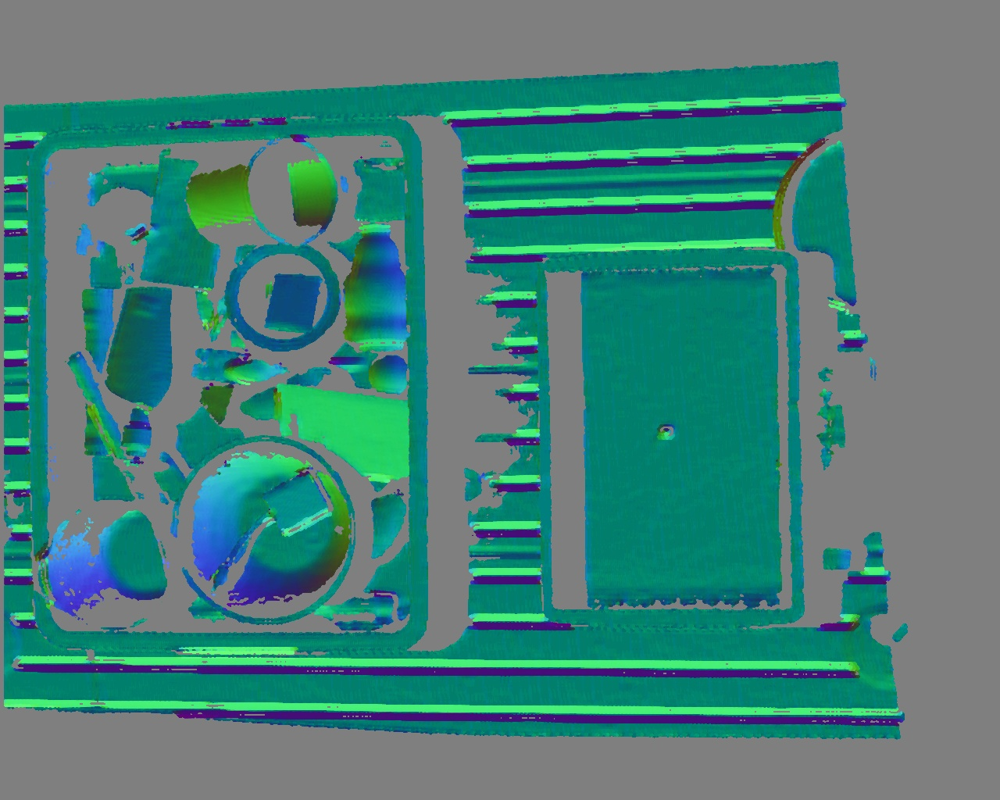

# normalSpeed
A fast algorithm for comupting the normal of the depth img. And warp it with pybind11. Modified from the code in line 702 of [PCL linemod package](http://docs.ros.org/en/hydro/api/pcl/html/surface__normal__modality_8h_source.html#702) and [patch_linemod](https://github.com/meiqua/patch_linemod/tree/master/linemodLevelup).

## pre requirements:
1. opencv3
2. numpy
3. [pybind11](https://github.com/pybind/pybind11):
   ```
   pip3 install "pybind11[global]"
   
   # Or install from source code:
   git clone https://github.com/pybind/pybind11.git
   cd pybind11 && mkdir build && cd build && cmake .. 
   sudo make install
   pip3 install pybind11 --user
   ```

## setup
In bash:
```bash
cd normalSpeed
python3 setup.py install --user
```
or
```bash
cd normalSpeed
python3 setup.py build_ext --inplace
cd .. && cp normalSpeed/normalSpeed.* ./
```
## run 
In python:
```python

"""
The coordinate of depth and normal is in cv coordinate:
    - x is horizontal
    - y is down (to align to the actual pixel coordinates used in digital images)
    - right-handed: positive z look-at direction
"""

fx = 1736.0597
fy = 1740.7188

k_size = 5 # pixel, kernal size for computing the normal
distance_threshold = 2000  # mm, 
                           # Ignore pixels beyond this distance.
difference_threshold = 20  # mm, When computing normals,
                           # ignore contributions of pixels 
                           # whose depth difference with the 
                           # central pixel is above this threshold.
point_into_surface = False  # Regular normal point out from the mesh
							# surface

# depth - np.array, h x w depth image, in mm
normals_map = normalSpeed.depth_normal(
	depth, fx, fy, k_size, distance_threshold, difference_threshold, point_into_surface
)

```
## example
```bash
python3 example.py
```

You will get the normal map of a depth map as follows:

- Input depth map:
<div align=center></div>

- Output normal map:
<div align=center></div>


